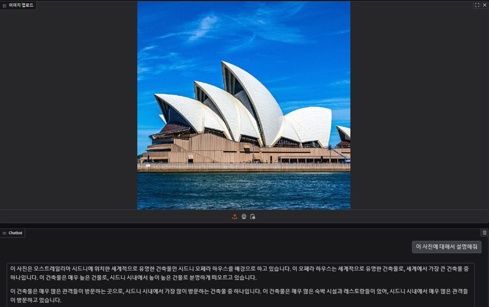

# 여행용 멀티모달 챗봇

<p align="center">
  
</p>


여행용 자료(이미지, 동영상, PDF)를 이용한 RAG 구축. VLLM과 Gradio를 통한 간단하고 빠른 웹 서비스 배포


# Model Server

GPU 서버(vast.ai)에서 vLLM을 이용하여 모델 서빙 

## Multimodal Model

<p align="center">
  
</p>

이미지와 텍스트를 처리하기 위한 멀티모달 모델 LLaVA 7b 사용

## vLLM

<p align="center">
  
</p>

- CLI

`vllm serve "llava-hf/llava-1.5-7b-hf" --chat-template template_llava.jinja`

- requirements

```
apt install python3 python3-pip
python3 -m spacy download ko_core_news_md
pip install -r requirements.txt
```


# Web Server

## RAG

두개의 서버로 웹과 모델 서버를 운용하기 위해 웹 서버에 RAG 시스템 구축

- 텍스트 변환
 
`pyMuPDF`를 이용한 PDF 파일 텍스트 변환 <br>
`MoviePy`, `Pydub`, `Speech_recognition`을 통한 동영상 파일 텍스트 변환 (RTF(Real Time Factor) : 0.1로 인한 사전 변환 필요 )


## Gradio Deploy CLI

<p align="center">
  
</p>


`python gradio_client.py`


  

